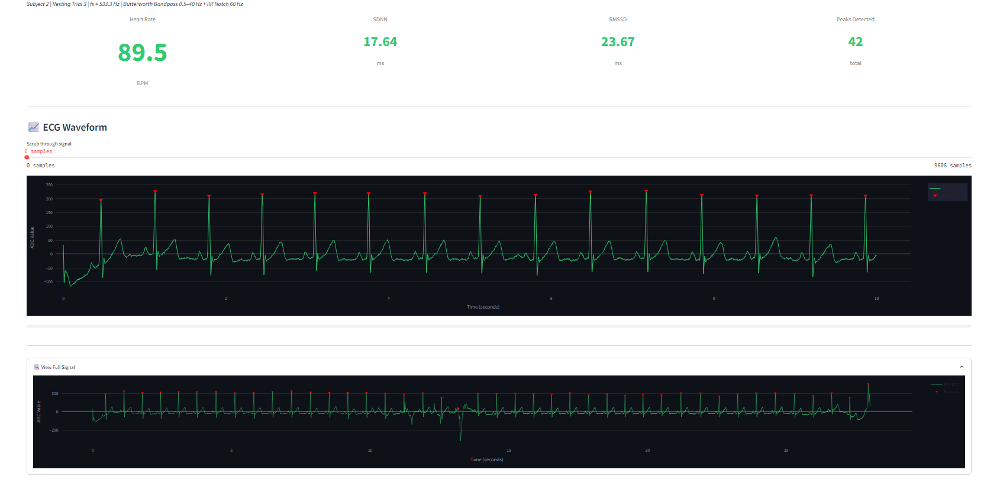
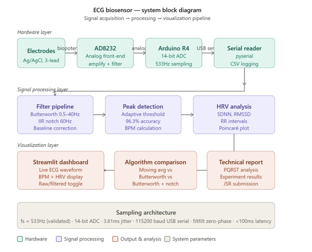
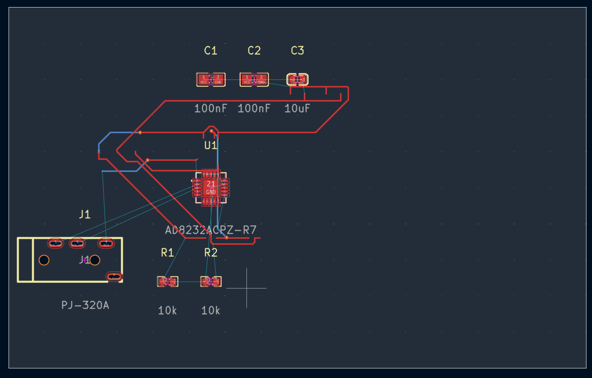
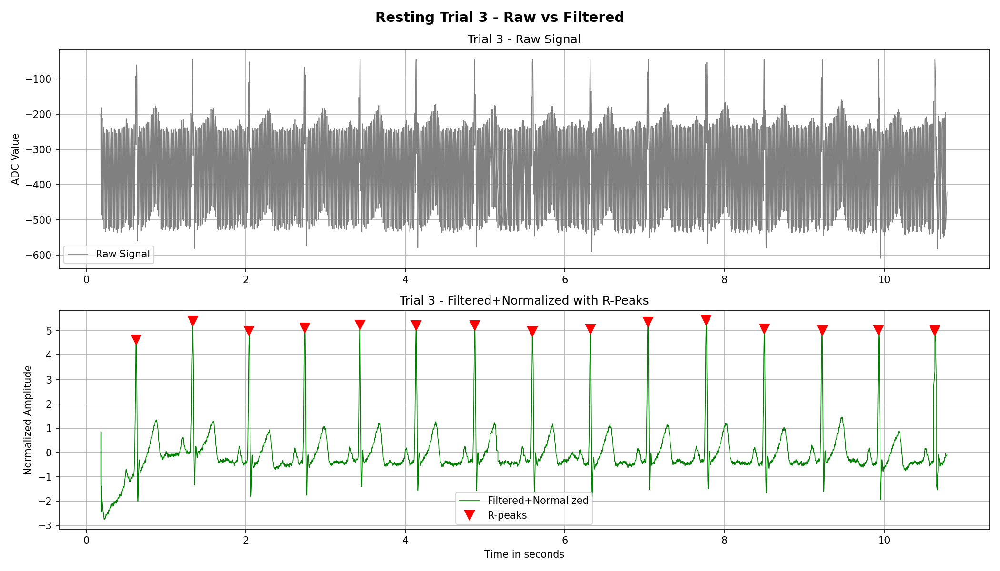
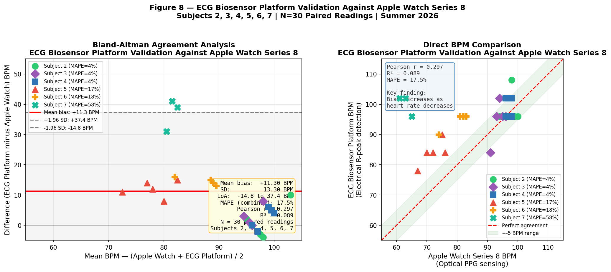
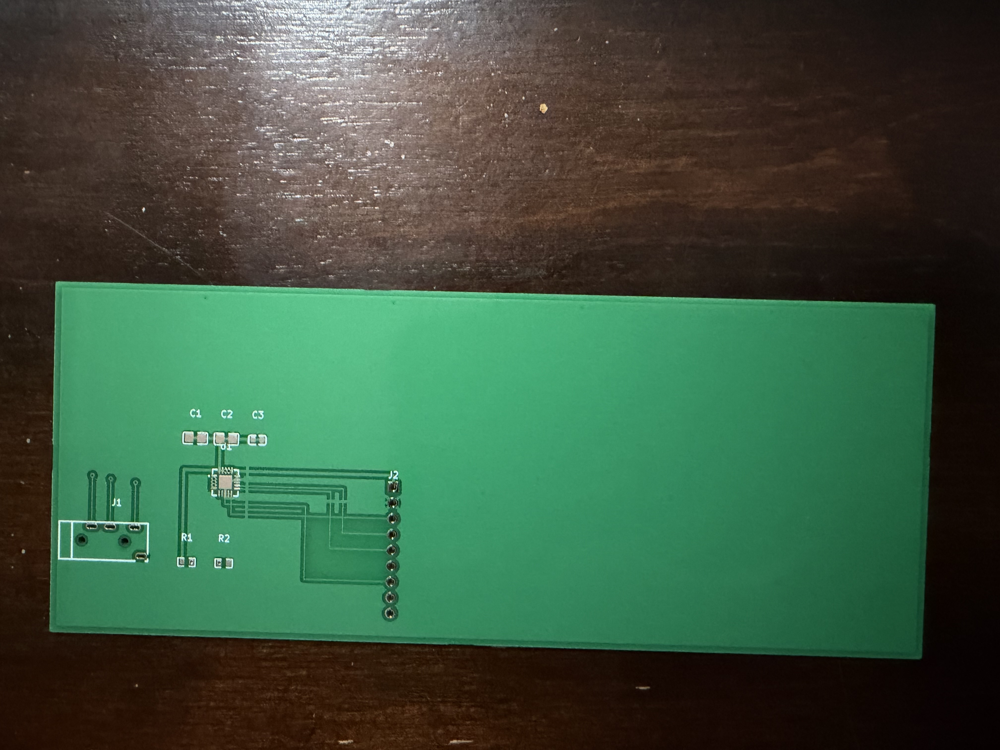

# ❤️ ECG Biosensor Platform

A low-cost, real-time ECG signal acquisition and analysis platform built from a SparkFun AD8232 and an Arduino Uno R4 Minima — designed, validated, and documented as an independent engineering research project.

> Built a $90.78 ECG biosensing platform that achieved 96.3% R-peak detection accuracy and identified a heart-rate-dependent performance limitation through multi-subject validation.

**🔗 Live Dashboard:** [ecg-biosensor.streamlit.app](https://ecg-biosensor.streamlit.app)
**📄 Manuscript:** Submitted to *Oxford Journal of Student Scholarship* (2026)



---

## Project Gallery

| | |
|---|---|
| **System Block Diagram** | **PCB Layout (KiCad, Rev A)** |
|  |  |
| **Raw vs. Filtered Signal** | **Validation Against Apple Watch Series 8** |
|  |  |

---

## Overview

Standard clinical ECG systems cost $1,000–$10,000, placing cardiac monitoring out of reach for many people and resource-limited healthcare settings. This project investigates whether consumer-grade hardware, combined with carefully engineered signal processing, can produce physiologically meaningful cardiac metrics at a fraction of that cost.

**Total hardware cost: $90.78**

| Metric | Result |
|---|---|
| R-peak detection accuracy | 96.3% (N=5 trials) |
| Validated sampling rate | 533.3 Hz |
| Apple Watch agreement (stable conditions) | MAPE 3.51–4.10% |
| Apple Watch agreement (combined, N=25) | r=0.762, MAPE=9.30% |
| Subjects | N=6, 30 resting trials |

---

## Key Finding

The platform's accuracy is **strongly heart-rate-dependent**: subjects with resting heart rates above 90 BPM achieved sub-4.5% error against an Apple Watch Series 8 reference, while subjects below 85 BPM saw error rates exceed 16%. This pattern is consistent with a fixed amplitude threshold (`median + 0.5 × SD`) becoming more susceptible to baseline drift as the interval between true R-peaks grows — and it directly motivates the adaptive threshold work planned for Phase 2.

---

## System Architecture

```
Electrodes (Ag/AgCl)
        │
        ▼
  AD8232 Analog Front-End  ──►  Arduino Uno R4 Minima (14-bit ADC, 533.3 Hz)
        │                              │
        │                       USB Serial (115200 baud)
        ▼                              ▼
  Right-Leg Drive Circuit       Python Signal Pipeline
                                       │
                         ┌─────────────┼─────────────┐
                         ▼             ▼             ▼
                  Butterworth      IIR Notch     R-peak Detection
                  Bandpass         Filter        (adaptive threshold)
                  (0.5–40 Hz)      (60 Hz)              │
                         └─────────────┼─────────────┘
                                       ▼
                            HRV Metrics (SDNN, RMSSD)
                                       │
                                       ▼
                          Streamlit Real-Time Dashboard
```

---

## Repository Structure

```
ecg-biosensor/
├── dashboard/          Streamlit application (live ECG dashboard, CSV playback)
├── docs/               Block diagram, additional documentation
├── experiments/        Protocols for all three structured experiments
├── firmware/           Arduino acquisition code
├── hardware/           KiCad PCB + schematics, Gerber fabrication files
├── report/             Research manuscript and technical report
├── results/            Raw and processed ECG data, all subjects/trials
├── signal_processing/  Filter, peak-detection, and HRV scripts
├── LICENSE
└── README.md
```

---

## Hardware

| Component | Part | Cost |
|---|---|---|
| ECG analog front-end | SparkFun AD8232 (SEN-12650) | $24.41 |
| Microcontroller | Arduino Uno R4 Minima | $19.99 |
| Electrodes | Ag/AgCl, 100-pack | $15.30 |
| Electrode cable | CAB-12970 | $9.60 |
| Misc. (breadboard, headers, prep pads) | — | $21.48 |
| **Total** | | **$90.78** |

A custom 2-layer PCB (140 × 56.5 mm, FR-4, LeadFree HASL) was designed in KiCad following the AD8232 datasheet reference design. Fabrication files were submitted to JLCPCB; boards were received June 13, 2026. Assembly and Phase 2 validation are in progress. See [`hardware/`](./hardware) for the schematic, PCB layout, and Gerber files.

---

## Signal Processing Pipeline

1. **Bandpass filter** — 4th-order Butterworth, 0.5–40 Hz, zero-phase (`scipy.signal.filtfilt`)
2. **Notch filter** — IIR notch at 60 Hz (Q=30) to reject powerline interference
3. **R-peak detection** — adaptive amplitude threshold (`median + 0.5 × SD`), minimum 319-sample inter-peak distance
4. **HRV computation** — SDNN and RMSSD from the resulting RR-interval series

See [`signal_processing/`](./signal_processing) for the full implementation.

---

## Experiments

| # | Title | Protocol |
|---|---|---|
| 1 | Resting vs. Exercise vs. Recovery | 5 resting trials + 3 exercise blocks (Subject 2) |
| 2 | Electrode Placement Robustness | 4 placement conditions × 3 trials (Subject 2) |
| 3 | Filter Algorithm Comparison | 3 algorithms × 5 trials (Subject 2) |

Full protocols and results are in [`experiments/`](./experiments) and [`results/`](./results).

---

## Validation

BPM measurements were validated against simultaneous Apple Watch Series 8 recordings across 25 paired readings from five subjects. Apple Watch was selected as an accessible consumer benchmark rather than a clinical gold standard — agreement results should be interpreted as comparative consumer-device performance, not clinical validation.

| Subject | Avg Apple Watch BPM | Mean Bias | MAPE |
|---|---|---|---|
| 2 | 97.4 | +1.0 | 3.87% |
| 3 | 93.8 | +1.0 | 4.10% |
| 4 | 97.0 | +2.6 | 3.51% |
| 5 | 72.0 | +12.0 | 16.72% |
| 6 | 80.2 | +14.6 | 18.28% |

---

## Future Work

- Adaptive, time-decaying threshold envelope to correct the heart-rate-dependent bias
- PCB assembly and Phase 2 experimental validation
- Extended multi-subject study (N ≥ 20)
- Benchmarking against a clinical-grade ECG or Holter monitor
- Bluetooth wireless data acquisition
- ML-based arrhythmia classification
- Battery-powered wearable enclosure

---

## Engineering Design Decisions

| Decision | Rationale |
|---|---|
| **AD8232 analog front-end** | Integrated instrumentation amplifier, RLD circuit, and onboard filtering in a single low-cost package ($24.41) |
| **Arduino Uno R4 Minima** | 14-bit ADC resolution and 48 MHz processor provide higher fidelity than Uno R3; native USB serial reliability |
| **4th-order Butterworth bandpass (0.5–40 Hz)** | Flat passband preserves P-wave morphology; zero-phase (filtfilt) eliminates timing distortion in batch analysis |
| **IIR notch filter (60 Hz, Q=30)** | Narrow rejection band removes powerline interference without attenuating adjacent ECG frequencies |
| **Adaptive threshold (median + 0.5 × SD)** | Scales automatically with signal amplitude across subjects and sessions; more robust than fixed thresholds |
| **533.3 Hz sampling rate** | Empirically measured (not assumed); exceeds the 250 Hz minimum for reliable QRS detection at 100 BPM |
| **KiCad for PCB design** | Open-source, industry-standard EDA tool with Python scripting API for automated layout |
| **Streamlit for dashboard** | Rapid deployment with zero frontend code; cloud-hosted for accessibility without hardware |

---

## Development Timeline

```
Phase 1 (Spring–Summer 2026)
│
├── Hardware assembly — breadboard prototype
│   AD8232 + Arduino Uno R4 Minima + Ag/AgCl electrodes
│
├── Signal processing pipeline
│   Butterworth bandpass → IIR notch → adaptive R-peak detection → HRV
│
├── Experiment 1 — Resting vs. exercise vs. recovery (N=5 trials)
│
├── Experiment 2 — Electrode placement robustness (4 conditions)
│
├── Experiment 3 — Filter algorithm comparison (3 algorithms)
│
├── Multi-subject validation — N=6 subjects, 30 resting trials
│
├── Apple Watch Series 8 validation — N=25 paired readings
│   Key finding: heart-rate-dependent bias identified
│
├── Streamlit dashboard deployed
│   ecg-biosensor.streamlit.app
│
├── KiCad PCB design (Rev A)
│   140 × 56.5 mm, 2-layer FR-4, LeadFree HASL
│
├── Manuscript submitted to Oxford Journal of Student Scholarship
│   Passed editorial screening → entered formal peer review
│
Phase 2 (In Progress)
│
├── PCB boards received from JLCPCB — June 13, 2026
│
└── Assembly and Phase 2 validation — pending
```

---

## Lessons Learned

**Subject 7 exposed a real limitation:** Subject 7's resting heart rate fell below 65 BPM, causing near-complete detection failure. Rather than excluding this data point, it was retained as a documented failure case — revealing that the static threshold algorithm has a hard lower bound on reliable performance. This became the central scientific contribution of the paper.

**The SNR paradox:** Standard SNR metrics penalized the Butterworth filter despite its superior morphological output. The raw signal's dominant DC offset and 60 Hz component inflate Moving Average SNR artificially. This showed that domain-specific evaluation metrics matter more than generic signal metrics for ECG filter quality.

**PCB design is iterative:** The initial KiCad layout had 52 DRC violations from component overlap and clearance errors. Resolving these iteratively — rather than starting over — taught systematic debugging of hardware design files.

**Breadboard instability is a real experimental confound:** Motion artifact during post-exercise recording was severe enough to invalidate the filtered pipeline. The custom PCB directly addresses this limitation by eliminating loose wire connections.

---

## Phase 2 — Hardware Assembly (In Progress)

Custom PCB (Rev A) received from JLCPCB on June 13, 2026.

| Bare PCB | Shipment Packaging |
|---|---|
|  |  |

Assembly and Phase 2 validation against the breadboard prototype are in progress.

---

## Running the Dashboard Locally

```bash
git clone https://github.com/shrimaan-rapuru/ECG-BIOSENSOR.git
cd ECG-BIOSENSOR/dashboard
pip install -r requirements.txt
streamlit run ecg_dashboard_demo.py
```

The hosted version at [ecg-biosensor.streamlit.app](https://ecg-biosensor.streamlit.app) runs in CSV playback mode and requires no hardware.

---

## Ethics Statement

This platform is intended solely for educational and engineering research purposes. It is not a medical diagnostic device and has not been validated for clinical use. All participants were anonymized as Subjects 2–7; no identifying health data is disclosed. Participation was voluntary with informed consent obtained prior to data collection.

---

## Author

**Shrimaan Rapuru**
The Early College at Guilford, Greensboro, NC

## License

MIT License — see [LICENSE](./LICENSE) for details.
